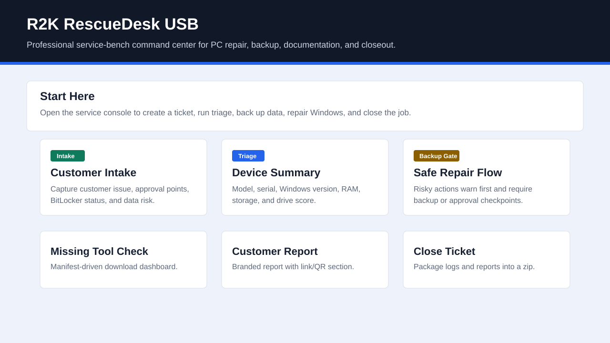
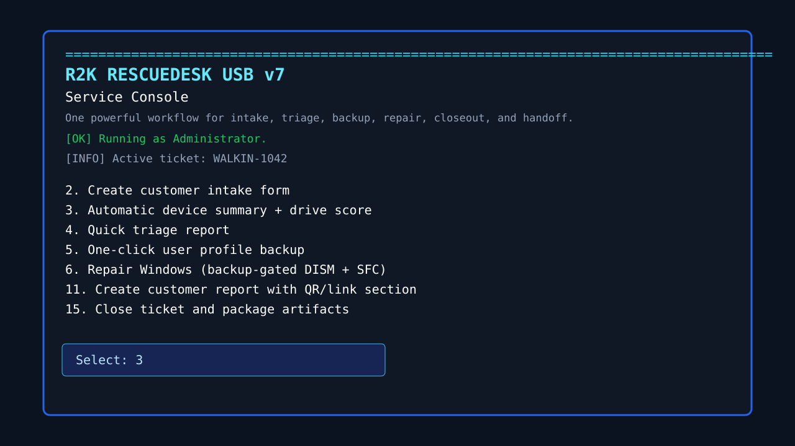
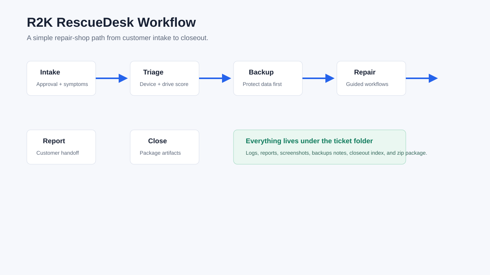

# R2K RescueDesk USB

**R2K RescueDesk USB** is a professional service-bench command center for PC repair shops. It helps a technician move from intake to triage, backup, repair, customer reporting, and closeout without hunting through a messy USB folder.

> Project page: [rice2k.github.io/r2k-rescuedesk-usb](https://rice2k.github.io/r2k-rescuedesk-usb/)  
> Source: [github.com/rice2k/r2k-rescuedesk-usb](https://github.com/rice2k/r2k-rescuedesk-usb)



## What It Is For

- Customer intake and approval capture.
- Automatic device summary and drive health scoring.
- Quick triage reports.
- One-click user profile backup.
- Backup-gated Windows repair actions.
- Network reset.
- Optional app cleanup with typed confirmation and logs.
- Malware cleanup workflow guidance.
- Post-repair checklist.
- Customer handoff report with link/QR section.
- Missing-tool dashboard and official download manifest.
- WinPE pre-Windows boot command center.
- Ticket closeout packaging.

## Why It Stands Out

- One obvious start button: `START_HERE.cmd`.
- Colorful GUI launcher plus powerful PowerShell console.
- Ticket folders are created automatically.
- Risk levels are visible in the manifest.
- Logs, reports, screenshots, hashes, and closeouts stay organized.
- Download links point to official vendor pages.
- Customer data and downloaded binaries are intentionally ignored by Git.

## Screenshots





## Folder Layout

```text
R2K_RescueDesk_USB
  START_HERE.cmd
  START_HERE.html
  Command_Center
  Tools
  Docs
  Reports
  Admin
  Boot
  assets
```

## How To Use

1. Copy `R2K_RescueDesk_USB` to a technician USB.
2. Double-click `START_HERE.cmd`.
3. Click **Open Service Console**.
4. Set the ticket number.
5. Run **Create customer intake form**.
6. Run **Automatic device summary + drive score**.
7. Run **Quick triage report**.
8. Back up user profiles before risky repairs.
9. Run the correct workflow or repair action.
10. Create the customer report.
11. Use **Close ticket and package artifacts**.

## Pre-Windows Repair

For startup failures, build the WinPE command center:

```powershell
.\Boot\WinPE\Build_R2K_WinPE.ps1
```

Then copy the generated ISO to a Ventoy USB and boot it before the internal Windows drive starts.

## Downloading Tools

Open:

```text
Admin\Download_Dashboard.html
```

or use the service console option:

```text
Check missing tools / open download dashboard
```

The manifest lives here:

```text
Admin\Manifests\Tool_Manifest.csv
```

## Safety Notes

- Back up customer data before risky repairs.
- Do not store customer data in GitHub.
- Do not commit downloaded commercial tools, EXEs, ISOs, or customer reports.
- Use official vendor downloads.
- Check commercial-use licensing for every third-party utility.

## License

The scripts and documentation in this repository are licensed under MIT. Third-party tools are not included and remain under their own licenses.
